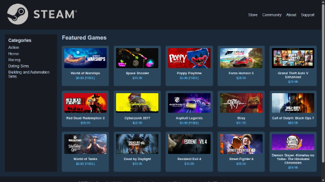

<div align="center">

# 🎮 Steam Web Clone

### A modern Steam-inspired gaming storefront built using **HTML**, **CSS**, and **JavaScript**

<p>
  <a href="https://satyansh-yadav0812.github.io/steam-web-clone/">
    
  </a>

  <a href="https://github.com/Satyansh-Yadav0812/steam-web-clone">
    
  </a>
</p>

<p>
  
  
  
  
  
</p>

</div>

---

# 📖 About

**Steam Web Clone** is a front-end recreation of Valve's Steam storefront. The project replicates the look and feel of Steam's web interface with a responsive layout, featured game cards, navigation bar, category sidebar, and a modern dark-themed design.

It was developed to improve my front-end development skills while practicing responsive layouts, reusable UI components, and interactive web design using HTML, CSS, and JavaScript.

---

# 🌐 Live Demo

### 🚀 https://satyansh-yadav0812.github.io/steam-web-clone/

---

# 📸 Project Preview

<p align="center">
  
</p>

---

# ✨ Features

- 🎮 Steam-inspired modern interface
- 🛒 Featured game storefront
- 📂 Categories sidebar
- 🎯 Game cards with pricing
- 📱 Fully responsive design
- ⚡ Smooth hover effects
- 🌙 Clean dark theme
- 🖥 Desktop & laptop friendly

---

# 🛠️ Tech Stack

| Technology | Purpose |
|------------|----------|
| HTML5 | Structure |
| CSS3 | Styling & Layout |
| JavaScript | Interactivity |
| GitHub Pages | Deployment |

---

# 📂 Folder Structure

```text
steam-web-clone/
│
├── assets/
│   ├── images/
│   ├── icons/
│
├── css/
│   └── style.css
│
├── js/
│   └── script.js
│
├── index.html
└── README.md
```

---

# 🚀 Getting Started

### Clone the repository

```bash
git clone https://github.com/Satyansh-Yadav0812/steam-web-clone.git
```

### Navigate to the project folder

```bash
cd steam-web-clone
```

### Run the project

Simply open **index.html** in your preferred web browser.

---

# 🧠 What I Learned

- Semantic HTML
- CSS Grid & Flexbox
- Responsive Web Design
- Component-based UI Layout
- JavaScript DOM Manipulation
- UI/UX Design Principles
- GitHub Pages Deployment
- Project Organization

---

# 🚀 Future Improvements

- [ ] Search functionality
- [ ] User authentication
- [ ] Wishlist system
- [ ] Shopping cart
- [ ] Game details page
- [ ] Backend integration
- [ ] Steam API integration
- [ ] Better mobile optimization

---

# 👨‍💻 Author

### **Satyansh Yadav**

<p>
  <a href="https://github.com/Satyansh-Yadav0812">
    
  </a>

  <a href="mailto:satyansh.25b01011354@abes.ac.in">
    
  </a>
</p>

📧 **satyansh.25b01011354@abes.ac.in**

---

<div align="center">

## ⭐ If you enjoyed this project, consider giving it a star!

Made with ❤️ by **Satyansh Yadav**

</div>
